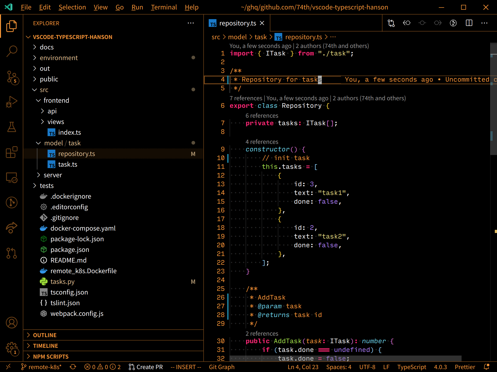
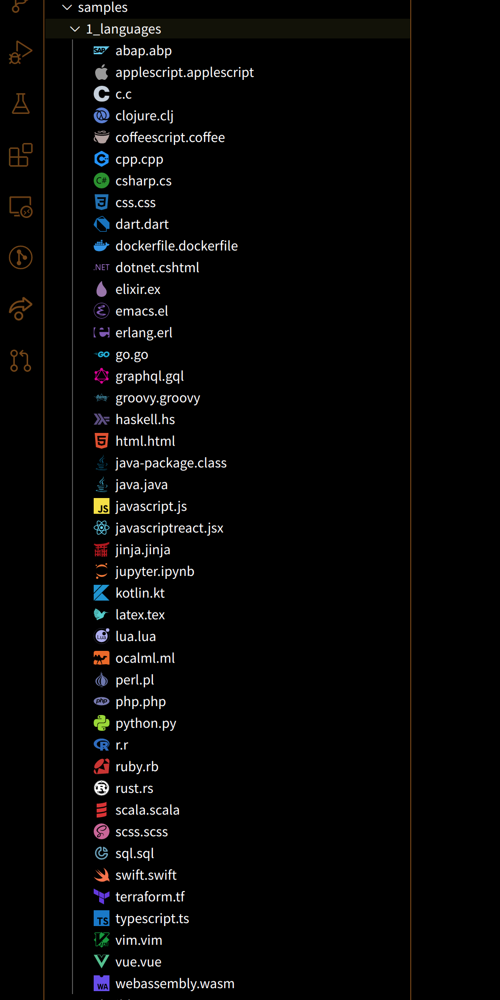
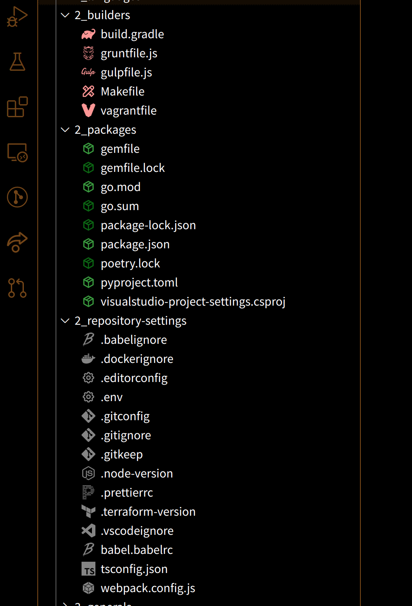
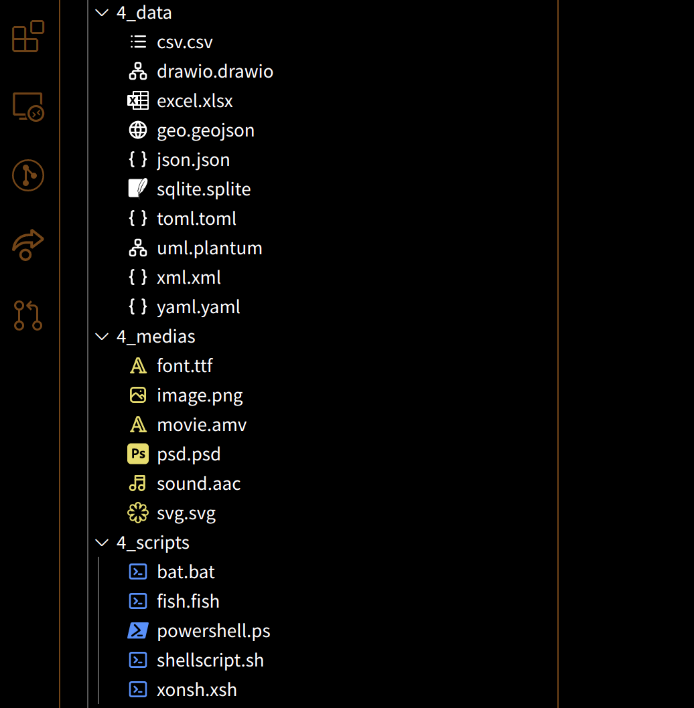
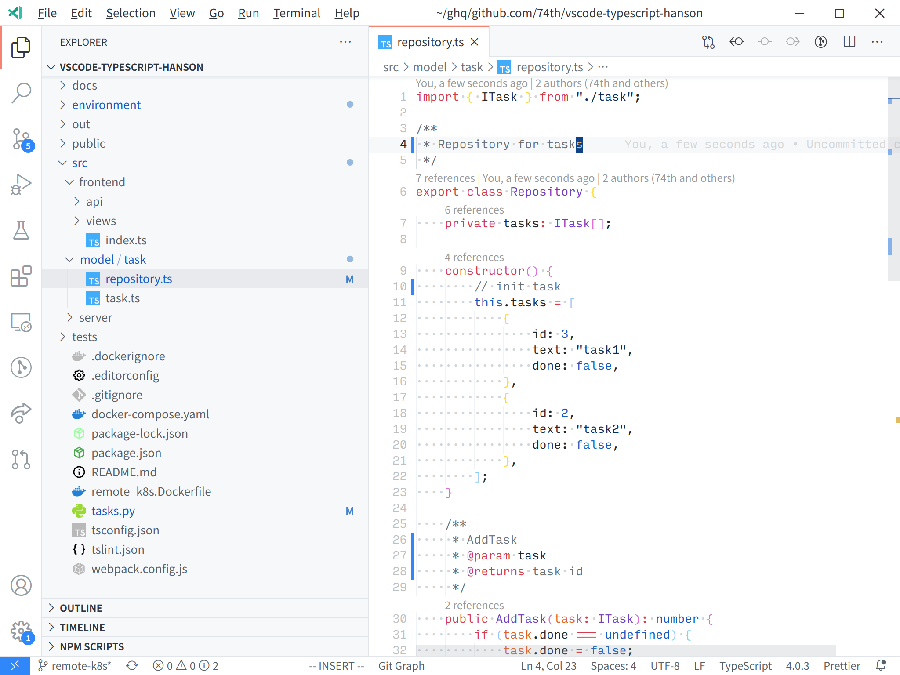

# High Contrast File Icons Theme for VS Code

File Icons Theme for High Contrast Themes.

Recommended Theme: [Monokai Charcoal high contrast](https://marketplace.visualstudio.com/items?itemName=74th.monokai-charcoal-high-contrast)

## feature

- Match for High Contrast Themes
- Repository Settings are not colored (.gitignore, .editorconfig, ...)
- Unified color scheme (media: yellow, package: green, data(json, csv,...): white, ...)
- Dark and Color Theme

## Sample

### Languages

### Languages and Package Settings

### Generals

### Light Theme

## Materials

- [Simple Icons](https://github.com/simple-icons/simple-icons) (CC0 1.0 Unicersal)
- [Table Icons](https://github.com/tabler/tabler-icons) (MIT License)

## License

MIT License
